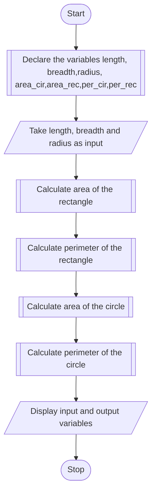

## PROBLEM 1.2
The length and breadth of a rectangle and radius of a circle are input through the keyboard. Write a program to calculate the area and perimeter of the rectangle, and the area and circumference of the circle.

### ALGORITHM:
1. Start
2. Declare float variables length, breadth,radius, area_cir,area_rec,per_cir,per_rec
3. Take length, breadth and radius as input
4. Calculate the area of the rectangle using the formula area_rec = length*breadth;
5. Calculate the perimeter of the rectangle using the formula per_rec = 2*(length+breadth);
6. Calculate the area of the circle using the formula area_cir = 3.14*radius^2;
7. Calculate the perimeter of the circle using the formula per_cir = 2* 3.14 *radius;
8. Display the input and output variables
9. Stop


### PSEUDOCODE:

```pseudocode
DECLARE FLOAT length, breadth,radius, area_cir,area_rec,per_cir,per_rec
INPUT length,breadth,radius
ASSIGN area_rec to length*breadth
ASSIGN per_rec to 2*(length+breadth)
ASSIGN area_cir to 3.14*radius^2
ASSIGN per_cir to 2*3.14*radius
DISPLAY "The length of the rectangle:"
DISPLAY length
DISPLAY "The breadth of the rectangle:"
DISPLAY breadth
DISPLAY "The radius of the circle:"
DISPLAY radius
DISPLAY "The area of the rectangle:"
DISPLAY area_rec
DISPLAY "The perimeter of the rectangle:"
DISPLAY per_rec
DISPLAY "The area of the circle:"
DISPLAY area_cir
DISPLAY "The perimeter of the circle:"
DISPLAY per_cir
```

### FLOWCHART:


