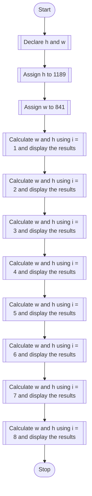

## PROBLEM 1.3
Paper of size A0 has dimensions 1189 cm x 841 mm. Each subsequent size A(n) is defined as A(n-1) cut in half, parallel to its shorter sides. 
Thus, a paper of size A1 would have dimensions 841 mm x 594 mm. Write a program to calculate and print the paper sizes A1 to A8.


### ALGORITHM:
1. Start
2. Declare float variables h and w.
3. Assign h to 1189 and w to 841.
4. Display "size of A0: h x w"
5. Calculate the size of A1 as:
w = 2^(-0.25 - 0.5 * i) * 1000,h = 2^(0.25 - 0.5 * i) * 1000, taking i as 1.
6. Repeat Step 5 for i = 2 to i= 8
7. Display the sizes of A1 to A8.
8. Stop

### PSEUDOCODE:

```pseudocode
DECLARE FLOAT h,w
ASSIGN h to 1189
ASSIGN w to 841
DECLARE INTEGER i
ASSIGN i to 0
DISPLAY "Size of A0: hxw"
ASSIGN w to 2^(-0.25 - 0.5 * 1) * 1000
ASSIGN h to 2^(0.25 - 0.5 * 1) * 1000
DISPLAY "Size of A1: hxw"
ASSIGN w to 2^(-0.25 - 0.5 * 2) * 1000
ASSIGN h to 2^(0.25 - 0.5 * 2) * 1000
DISPLAY "Size of A2: hxw"
ASSIGN w to 2^(-0.25 - 0.5 * 3) * 1000
ASSIGN h to 2^(0.25 - 0.5 * 3) * 1000
DISPLAY "Size of A3: hxw"
ASSIGN w to 2^(-0.25 - 0.5 * 4) * 1000
ASSIGN h to 2^(0.25 - 0.5 * 4) * 1000
DISPLAY "Size of A4: hxw"
ASSIGN w to 2^(-0.25 - 0.5 * 5) * 1000
ASSIGN h to 2^(0.25 - 0.5 * 5) * 1000
DISPLAY "Size of A5: hxw"
ASSIGN w to 2^(-0.25 - 0.5 * 6) * 1000
ASSIGN h to 2^(0.25 - 0.5 * 6) * 1000
DISPLAY "Size of A6: hxw"
ASSIGN w to 2^(-0.25 - 0.5 * 7) * 1000
ASSIGN h to 2^(0.25 - 0.5 * 7) * 1000
DISPLAY "Size of A7: hxw"
ASSIGN w to 2^(-0.25 - 0.5 * 8) * 1000
ASSIGN h to 2^(0.25 - 0.5 * 8) * 1000
DISPLAY "Size of A8: hxw"
```

### FLOWCHART
