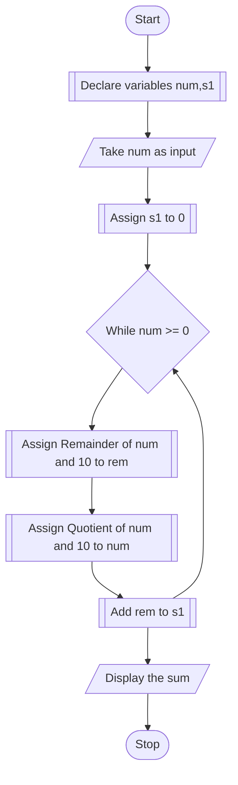

# CHAPTER-2: C INSTRUCTIONS

## PROBLEM 2.1
If a five-digit number is input through the keyboard, write a program to calculate the sum of its digits.

### ALGORITHM
1. Start
2. Declare int variables num,and s1
3. Take num as input
4. Assign s1 to 0
5. divide num by 10 and store the remainder in variable rem.
6. add rem to sum.
7. divide num by 10 and re-assign num to be the quotient.
8. Repeat steps 5-7 until num becomes less than or equal to zero
9. display the sum s1.
10. Stop


### PSEUDOCODE

```pseudocode
DECLARE INTEGER num,s1
INPUT num
ASSIGN s1 to 0
WHILE num <= 0
    ASSIGN Remainder(num,10) to rem
    ASSIGN num/10 to num
    ADD rem to s1
ENDWHILE
DISPLAY "The sum of digits of number is: "
DISPLAY s1
```

### FLOWCHART

