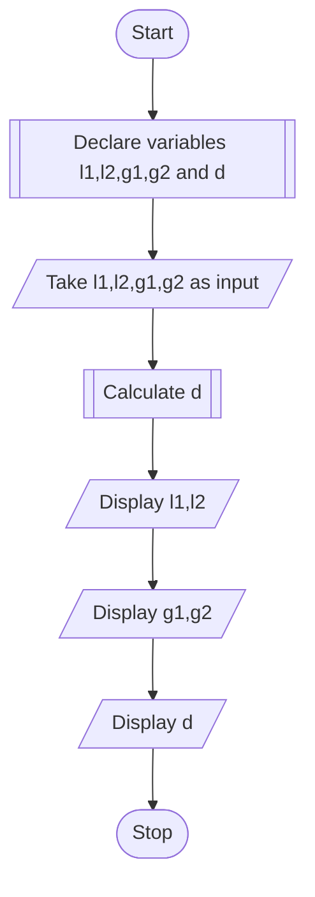

# PROBLEM - 3
Write a program to recieve values of latitude(L1,L2) and longitude(G1,G2), in degrees, of two places on earth and output the distance between the distance(D) between them in nautical miles. The formula for the distance in nautical miles is:
**D = 3963 cos-1(sin L1 sin L2+ cos L1 cos L2*cos(G2-G1))**

# ALGORITHM:
1. Start
2. Declare float variables l1,l2,g1,g2 and d
3. Take l1,l2,g1 and g2 as input
4. Calculate d using d = 3963 cos-1(sin L1 sin L2+ cos L1 cos L2*cos(G2-G1))
5. Display the input and results
6. Stop

# PSEUDOCODE

```pseudocode
DECLARE FLOAT l1,l2,g1,g2,d
INPUT l1,l2,g1,g2
ASSIGN d to 3963 cos-1(sin L1 sin L2+ cos L1 cos L2*cos(G2-G1))
DISPLAY "Latitudes: "
DISPLAY l1,l2
DISPLAY "Longitudes: "
DISPLAY g1,g2
DISPLAY "Distance in nautical miles: "
DISPLAY d
```
# FLOWCHART

