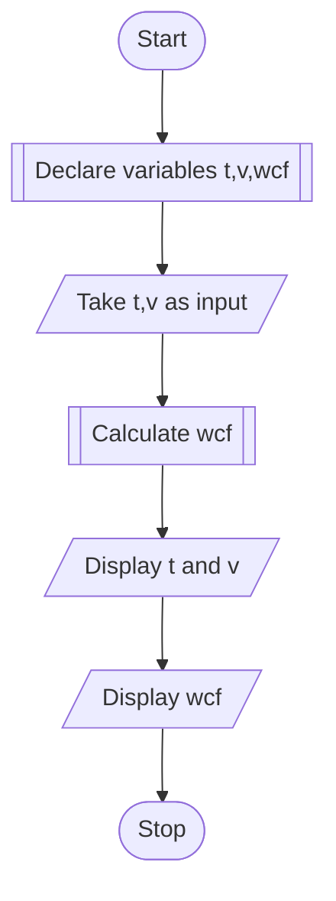

## PROBLEM 2.4
Wind chill factor is the felt air temperature on
exposed skin due to wind. The wind chill temperature
is always lower than the air temperature, and is
calculated using the following formula:
wcf = 35.74+0.6215t +(0.4275t - 35.75)*v^0.16
where t is temperature, v is wind velocity.
Write a program to recieve values of t and v and
calculate wcf.

### ALGORITHM
1. Start
2. Declare float variables t,v and wcf
3. Take t and v as input
4. Calculate wcf using: wcf = 35.74+0.6215t +(0.4275t - 35.75)*v^0.16
5. Display the inputs and results.
6. Stop

### PSEUDOCODE

```pseudocode
DECLARE FLOAT t,v,wcf
INPUT t,v
ASSIGN wcf to 35.74+0.6215t +(0.4275t - 35.75)*v^0.16
DISPLAY "Temperature : "
DISPLAY t
DISPLAY "Velocity : "
DISPLAY v
DISPLAY "Wind chill factor : "
DISPLAY wcf
```

### FLOWCHART

