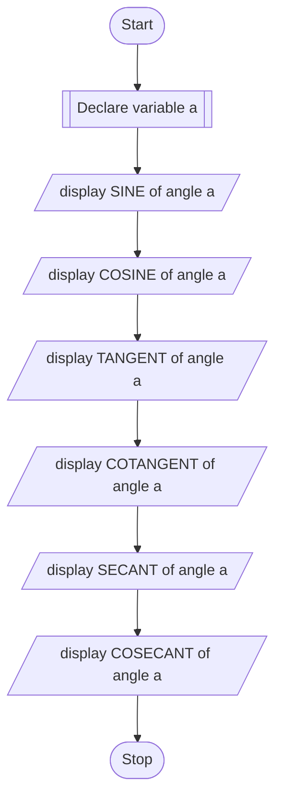

## PROBLEM 2.5
If value of an angle is input through the keyboard,
write a program to print all its trigonometric ratios.

### ALGORITHM
1. Start
2. Declare float variable a
3. Calculate sin(a) and print the result
4. Calculate cos(a) and print the result
5. Calculate tan(a) and print the result
6. Calculate cot(a) and print the result
7. Calculate sec(a) and print the result
8. Calculate cosec(a) and print the result
9. Stop

### PSEUDOCODE

```pseudocode
DECLARE FLOAT a
DISPLAY "SINE of angle a is : sin(a)"
DISPLAY "COSINE of angle a is : cos(a)"
DISPLAY "TANGENT of angle a is : tan(a)"
DISPLAY "COTANGENT of angle a is : cot(a)"
DISPLAY "SECANT of angle a is : sec(a)"
DISPLAY "COSECANT of angle a is : cosec(a)"
```

### FLOWCHART


