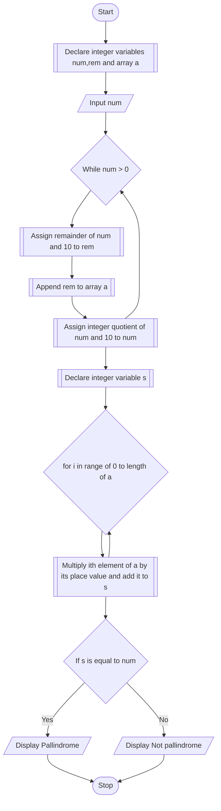

# PROBLEM 1
A five-digit number is entered through the keyboard. Write a program to obtain the reversed number and to determine whether the original and reversed numbers are equal or not

# ALGORITHM
1. Start
2. Declare integer variable num, and an array a
3. Take num as input
4. Take the remainder of num and 10 and add to the array.
5. Reassign num to integer division of num and 10
6. Repeat steps 4 and 5 until num<=0
7. Declare a variable s
8. Multiply 2**(length(a)-i) to the ith element of a, and add to the variable s
9. Repeat step 8 for each element in a
10. check if s is equal to num:
a. If yes, display "Pallindrome"
b. Else, display "Not pallindrome"
11. Stop

# PSEUDOCODE

```pseudocode

FUNCTION CountDigits(INTEGER num)
    DECLARE INTEGER result and ASSIGN 0 to it
    WHILE num != 0
        ASSIGN num/10 to num
        INCREMENT result
    ENDWHILE
    RETURN result
ENDFUNCTION

FUNCTION main
    DECLARE INTEGER num,rem,temp,n
    INPUT num
    ASSIGN CountDigits(num) to n
    DECLARE INTEGER ARRAY a[n]
    ASSIGN num to temp
    WHILE temp>0
        ASSIGN REMAINDER(temp,10) to rem
        APPEND rem to ARRAY a
        ASSIGN temp/10 to temp
    ENDWHILE
    DECLARE INTEGER s = 0
    FOR i IN RANGE OF 0 to length(a)
        ASSIGN s to s*10 + a[i]
    ENDFOR

    IF s is equal to num
        DISPLAY "Pallindrome"
    ELSE
        DISPLAY "Not Pallindrome"
    ENDIF
ENDFUNCTION
```

# FLOWCHART


