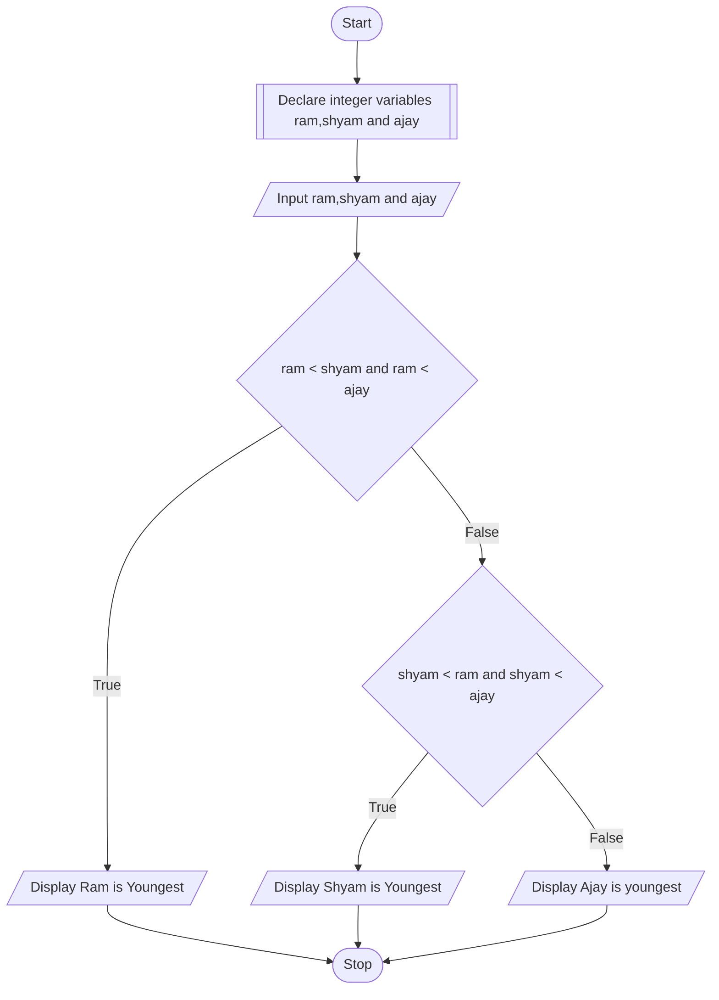

## PROBLEM 3.2
If ages of Ram, Shyam and Ajay are input through the keyboard, write a program to determine the youngest of the three

### ALGORITHM
1. Start
2. Declare integer variables ram, shyam and ajay
3. Input ram, shyam and ajay
4. If ram is less than both shyam and ajay, display "ram is youngest".
5. Else if shyam is less than both ram and ajay, display "shyam is youngest".
6. Else display "Ajay is youngest"
7. Stop

### PSEUDOCODE

```pseudocode
DECLARE INTEGER ram,shyam,ajay
INPUT ram,shyam,ajay
IF ram < shyam and ram < ajay
    DISPLAY "Ram is youngest"
ELSE IF shyam < ram and shyam < ajay
    DISPLAY "Shyam is youngest"
ELSE
    DISPLAY "Ajay is youngest"
ENDIF
```

### FLOWCHART

