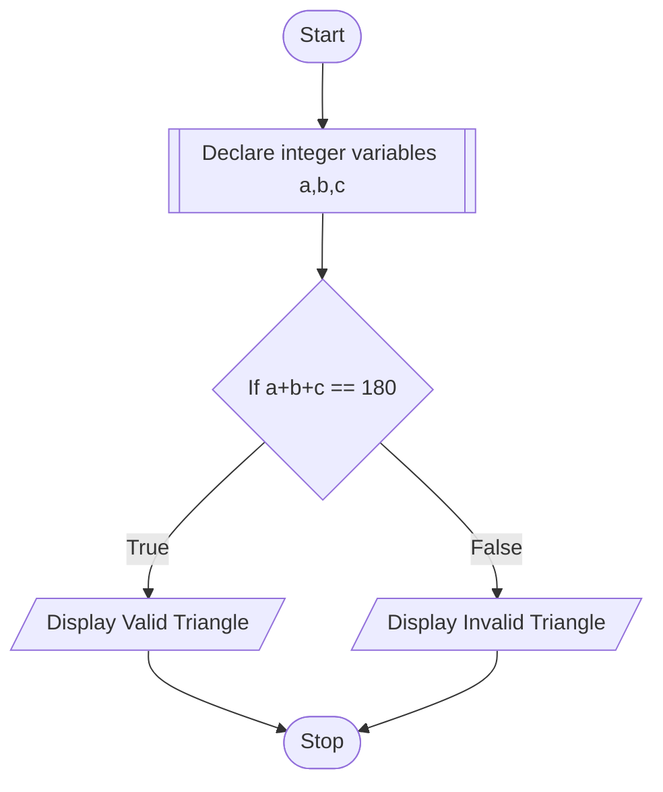

# PROBLEM 3

Write a program to check whether a triangle is valid or not, if three angles of the triangle are entered through the keyboard. A triangle is valid if the sum of all the three angles is equal to 180 degrees

# ALGORITHM

1. Start
2. Declare integer variables a,b,c
3. If a+b+c == 180, display "Valid Triangle"
4. Else, display "Invalid triangle"
5. Stop

# PSEUDOCODE:

```pseudocode
DECLARE INTEGER a,b,c
INPUT a,b,c
IF a+b+c == 180
    DISPLAY "Valid Triangle"
ELSE
    DISPLAY "Invalid Triangle"
ENDIF
```

# FLOWCHART

