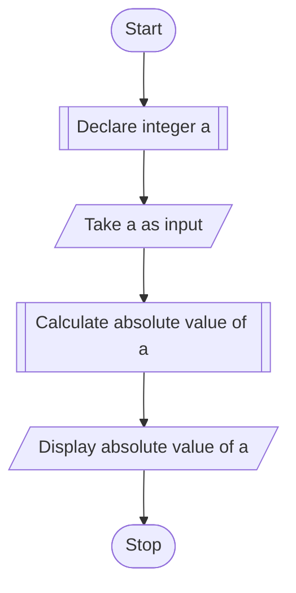

# PROBLEM 4
Write a program to find the absolute value of a number entered through the keyboard

# ALGORITHM

1. Start
2. Declare variable a
3. Input a
4. Calculate abs(a)
5. Display "Absolute value: ",abs(a)
6. Stop

# PSEUDOCODE

```pseudocode
DECLARE INTEGER a
INPUT a
DISPLAY "Absolute value of a: "
DISPLAY abs(a)
```

# FLOWCHART

