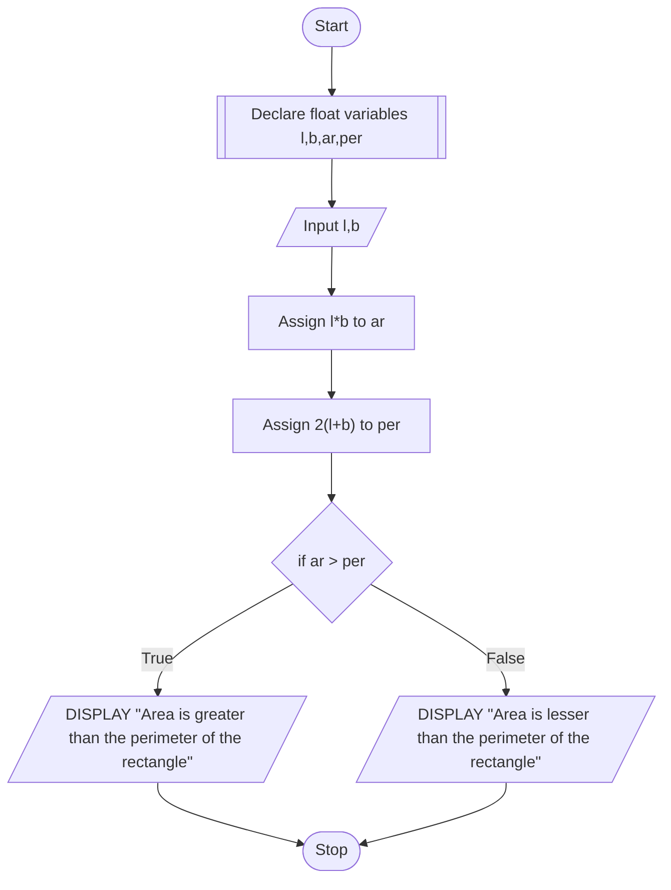

# PROBLEM 5
Given the length and breadth of a rectangle, write a program to find whether the area of the rectangle greater than its perimeter. For example, the area of the rectangle with length = 5 and breadth = 4 is greater than its perimeter

# ALGORITHM

1. Start
2. Declare float variables l,b,ar,per
3. Assign l*b to ar
4. Assign 2(l+b) to per
5. If ar > per, display "Area is greater than the perimeter of the rectangle"
6. Else, display "Area is lesser than the perimeter of the rectangle"
7. Stop

# PSEUDOCODE

```pseudocode
DECLARE FLOAT l,b,ar,per
INPUT l,b
ASSIGN l*b to ar
ASSIGN 2(l+b) to per
IF ar > per
    DISPLAY "Area is greater than the perimeter of the rectangle"
ELSE
    DISPLAY "Area is lesser than the perimeter of the rectangle"
ENDIF
```

# FLOWCHART

