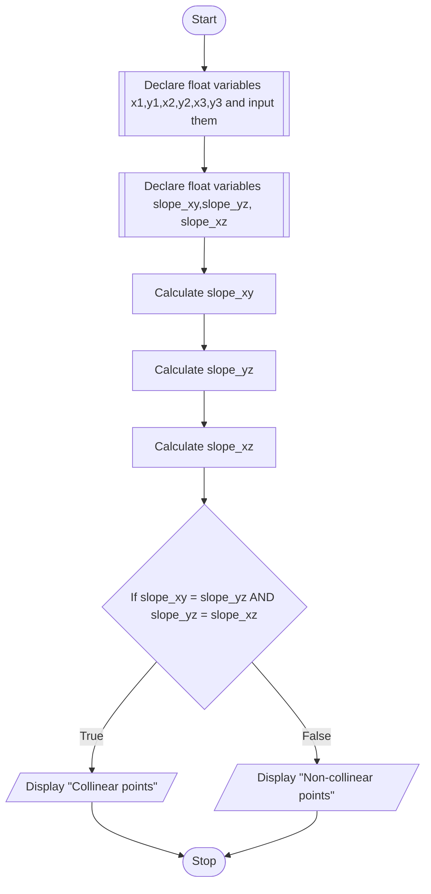

## PROBLEM 3.6
Given the three points X(x1,y1), Y(x2,y2) and Z(x3,y3), write a program to check if the three points fall on straight line.

Condition for collinearity:

$$ Slope(XY) = Slope(YZ) = Slope(XZ)$$
WHERE,
$$Slope(XY) = \frac{y2-y1}{x2-x1}$$

$$Slope(YZ) = \frac{y3-y2}{x3-x2}$$

$$Slope(XZ) = \frac{y3-y1}{x3-x1}$$

### ALGORITHM

1. Start
2. Declare float variables x1,y1,x2,y2,x3,y3,slope_xy,slope_yz,slope_xz
3. Input x1,y1,x2,y2,x3,y3
4. Assign (y2-y1)/(x2-x1) to slope_xy
5. Assign (y3-y2)/(x3-x2) to slope_yz
6. Assign (y3-y1)/(x3-x1) to slope_xz
7. If slope_xy = slope_yz and slope_yz = slope_xz, Display "Collinear points"
8. Else, display "non-collinear points"
9. Stop

### PSEUDOCODE

```pseudocode
DECLARE FLOAT x1,y1,x2,y2,x3,y3
DECLARE FLOAT slope_xy,slope_yz,slope_xz
INPUT x1,y1,x2,y2,x3,y3
ASSIGN (y2-y1)/(x2-x1) to slope_xy
ASSIGN (y3-y2)/(x3-x2) to slope_yz
ASSIGN (y3-y1)/(x3-x1) to slope_xz
IF slope_xy = slope_yz AND slope_yz = slope_xz
    DISPLAY "Collinear points"
ELSE
    DISPLAY "Non-collinear points"
ENDIF
```

### FLOWCHART


