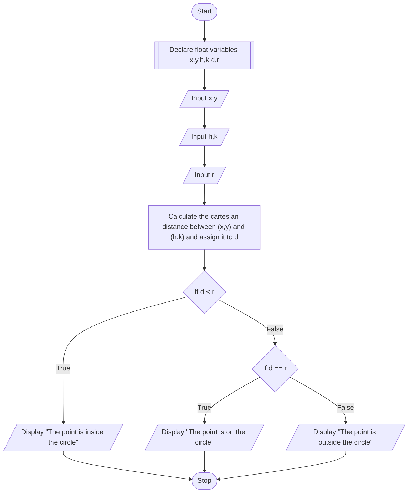

# PROBLEM 7
Given the coordinates C(x,y) of the center of the circle and its radius r,
write a program that will determine whether a point P(h,k) lies inside the circle, on the circle, or outside the circle.\

**Distance between P(x,y) and centre C(h,k) is:**
$$D = \sqrt{{(x - h)^2 + (y - k)^2}} $$
> If $D < r$, the point lies inside the circle.\
> If $D = r$, the point lies on the circle.\
> If $D > r$, the point lies outside the circle.

# ALGORITHM

1. Start
2. Declare float variables x,y,h,k,d,r
3. Input x,y
4. Input h,k
5. Input r
6. Calculate the cartesian distance between (x,y) and (h,k) and assign it to d
7. If d < r, display "The point is inside the circle"
8. Else If d = r, display "The point is on the circle"
9. Else, display "The point is outside the circle"
10. Stop

# PSEUDOCODE

```pseudocode
DECLARE FLOAT x,y,h,k,d,r
INPUT x,y
INPUT h,k
INPUT r
ASSIGN sqrt((x-h)^2 + (y-k)^2) to d
IF d < r
    DISPLAY "The point is inside the circle"
ELSE IF d = r
    DISPLAY "The point is on the circle"
ELSE
    DISPLAY "The point is outside the circle"
ENDIF
```

# FLOWCHART

