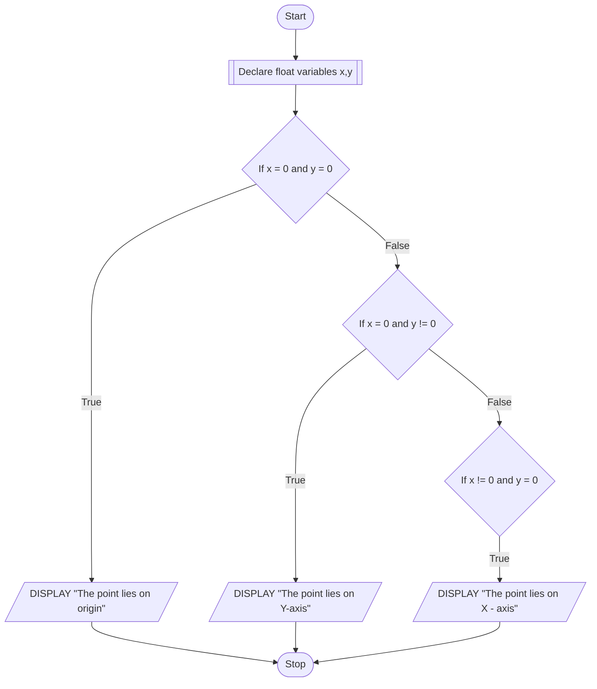

## PROBLEM 3.8
Given a point (x,y), write a program to find out if it lies on X-axis,
Y-axis or origin.

### ALGORITHM
1. Start
2. Declare float variables x and y
3. If x == 0 and y == 0, display "The point lies on origin"
4. Else if x = 0 and y!= 0, display "The point lies on Y-axis"
5. Else if x!= 0 and y = 0, display "The point lies on X-axis"
6. Stop


### PSEUDOCODE

```pseudocode
DECLARE FLOAT x,y
IF x = 0 AND y = 0
    DISPLAY "The point lies on origin"
ELSE IF x = 0 AND y != 0
    DISPLAY "The point lies on Y - axis"
ELSE IF x != 0 AND y = 0
    DISPLAY "The point lies on X - axis"
ENDIF
```

### FLOWCHART

