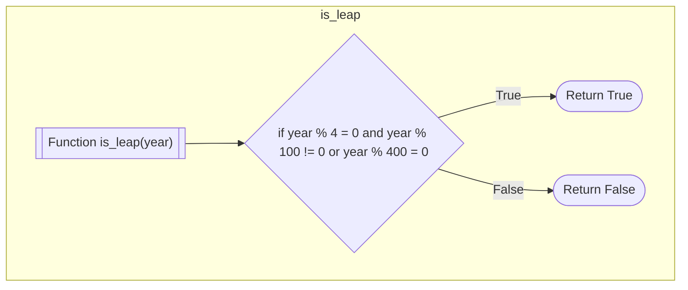
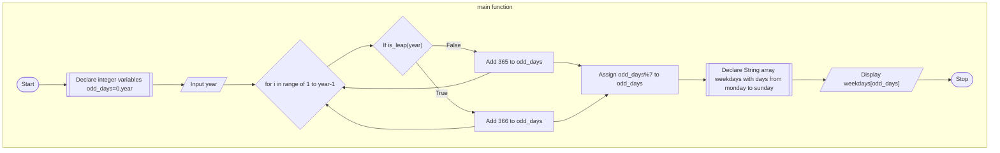

## PROBLEM 3.9
According to Gregorian Calendar, it was Monday on the date 01/01/01. If any year is input through the keyboard, write a program to find out what is the day on 1st January of this year.

Year = 200

1st january 01 to 1st january 200 = 365*200 (without considering leap years) + DAYS IN LEAP YEARS

odd days = 365*200+DAYS IN LEAP YEARS/7

|No.of odd days | Week day|
|:---:|:---:|
|0|Monday|
|1|Tuesday|
|2|Wednesday|
|3|Thursday|
|4|Friday|
|5|Saturday|
|6|Sunday|

### ALGORITHM

1. Start
2. Declare the integer variables year,odd_days
3. Input year
4. Create a helper function is_leap(year) to determine whether the given year is a leap year or not
5. Run a loop from integer i = 0 to year-1
6. In that loop, check if each i is a leap year or not using the helper function defined above.
7. If the condition is true, add 366 to odd_days
8. Else, add 365 to odd_days
9. After the loop, assign the remainder of odd_days and 7 back to odd_days
10. Declare an string array weekdays with the days of week from monday to sunday
11. Display "The day of the week at 01.01.year is weekdays[odd_days]"
12. Stop


### PSEUDOCODE
```pseudocode
DECLARE INTEGER odd_days,year
INPUT year
ASSIGN 0 to odd_days
FUNCTION is_leap(year)
    IF REMAINDER(year,4) = 0 AND REMAINDER(year,100) != 0 OR  REMAINDER(year,400) = 0
        RETURN True
    ELSE
        RETURN False
    ENDIF
ENDFUNCTION

FUNCTION main
    FOR INTEGER i = 1 to year-1
        IF is_leap(year) == True
           ADD 366 to odd_days
        ELSE
            ADD 365 to odd_days
        ENDIF
    ENDFOR
    ASSIGN odd_days%7 to odd_days

    DECLARE STRING ARRAY weekdays
    ASSIGN ["Monday","Tuesday","Wednesday","Thursday","Friday","Saturday","Sunday"] to a
    
    DISPLAY weekdays[odd_days]

ENDFUNCTION
```

### FLOWCHART






