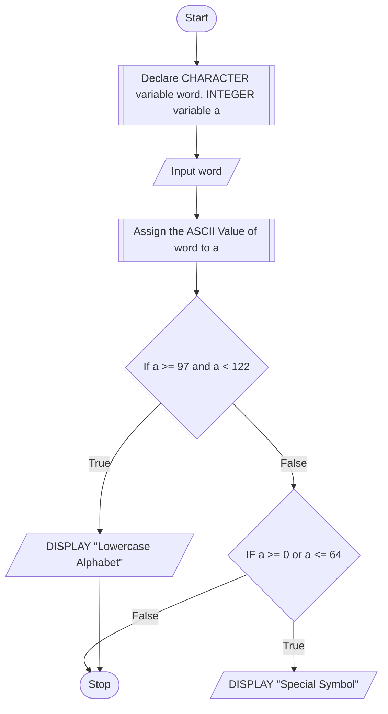

## PROBLEM 4.1
Using conditional operators determine:
1. Whether the character entered through the keyboard is a lowercase alphabet or not.
2. Whether the character entered through the keyboard is a special symbol or not.

ASCII Values:
LOWERCASE alphabets - 97 to 122
SPECIAL Symbols - 0 to 64
UPPERCASE alphabets - 65 to 96


### ALGORITHM

1. Start
2. Declare a character variable word, and integer variable a
3. Input word
4. Calculate the ASCII Value of the word variable and store it into a
5. If a >= 97 or a <= 122, Display "Lowercase alphabet"
6. If a >= 0 or a <= 64, Display "Special Symbol"
7. Stop

### PSEUDOCODE

```pseudocode
DECLARE CHARACTER word, INTEGER a
INPUT word
ASSIGN ASCII_VALUE of word to a
IF a >= 97 AND a <= 122
    DISPLAY "Lowercase Alphabet"
ENDIF
IF a >= 0 or a <= 64
    DISPLAY "Special Symbol"
ENDIF
```

### FLOWCHART




