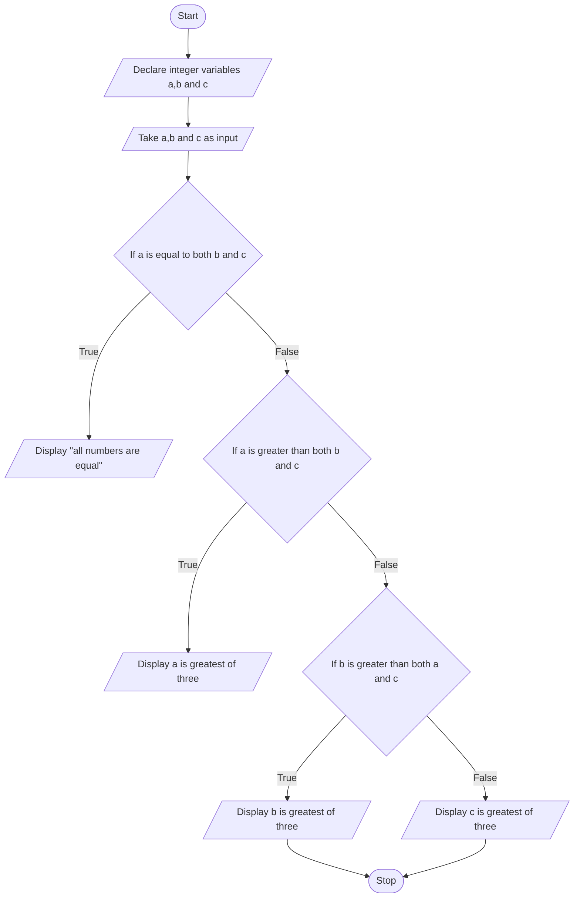

## PROBLEM 4.3
Write a program to find the greatest of the three numbers entered through the keyboard. Use conditional operators.

### ALGORITHM

1. Start
2. Declare integer variables a,b and c and take input
3. If a=b=c, display "all are equal". Else, go to step 4.
4. If a is greater than b and a is greater than c, display "a is greatest of three"
5. Else if b is greater than a and b is greater than c, display "b is greatest of three"
6. Else if c is greater than b and c is greater than a, display "c is greatest of three"
7. Stop
### PSEUDOCODE

```pseudocode
START
DECLARE INTEGER a,b,c
INPUT a,b,c
IF a == b == c
    DISPLAY "All three are equal"
ELSE
    IF a>b AND a>c
        DISPLAY "a is greatest of three"
    ELSE
        IF b>a AND b>c
            DISPLAY "b is greatest of three"
        ELSE
            DISPLAY "c is greatest of three"
        ENDIF
    ENDIF
ENDIF
STOP
```

### FLOWCHART

