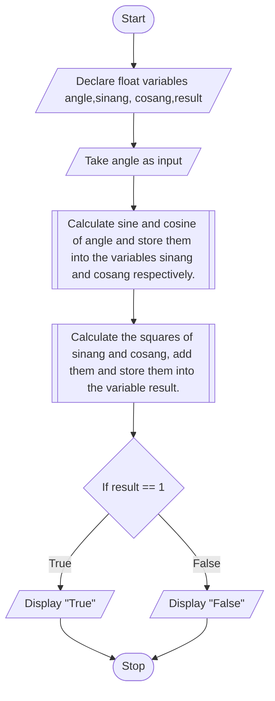

## PROBLEM 4
Write a program to recieve value of an angle in degrees and check whether the sum of squaresof sine and cosine of this angle is equal to 1

### ALGORITHM

1. Start
2. Declare an float variable angle,sinang,cosang,result.
3. Take angle as input
4. Calculate sine and cosine of angle and store them into the variables sinang and cosang respectively.
5. Calculate the squares of sinang and cosang, add them and store them into the variable result.
6. If result is equal to 1, display "True". Else, display "False"

### PSEUDOCODE

```pseudocode
START
DECLARE FLOAT angle,sinang,cosang,result
INPUT angle
ASSIGN sin(angle) to sinang
ASSIGN cos(angle) to cosang
ASSIGN sinang**2 + cosang**2 to result
IF result == 1
    DISPLAY "true"
ELSE
    DISPLAY "false"
ENDIF
STOP
```

### FLOWCHART

