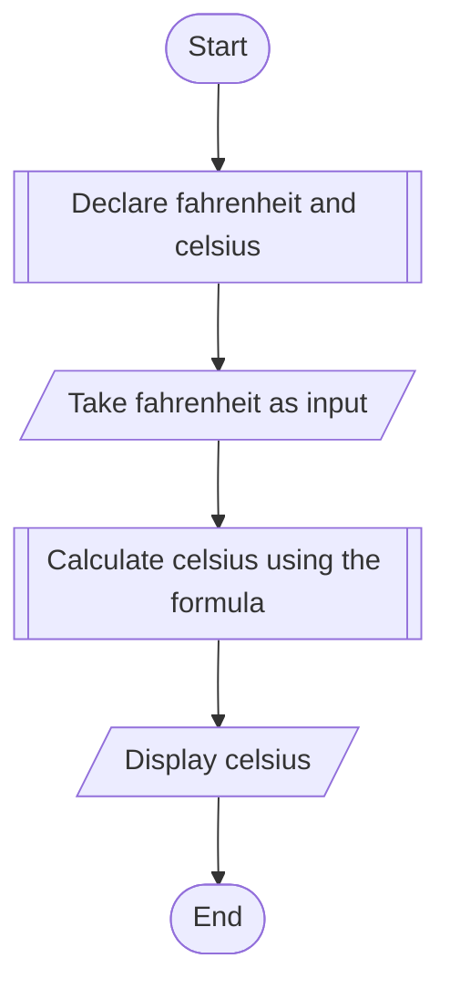

# PROBLEM 1
Temperature of a city in Farenheit degrees is input through the keyboard.
Write a program to convert this temperature into Centigrade degrees.

# ALGORITHM
1. Start
2. Declare float variables Farenheit and celsius
3. Take farenheit as input
4. Calculate Celsius from the formula celsius =  ((farenheit - 32) / 1.8)
5. Display the farenheit and celsius values
6. Stop

# PSEUDOCODE

```pseudocode
DECLARE FLOAT farenheit, celsius
INPUT farenheit
ASSIGN celsius to ((farenheit - 32) / 1.8);
DISPLAY "Value in farenheit is: "
DISPLAY farenheit
DISPLAY "Value in celsius is: "
DISPLAY celsius
```
# FLOWCHART




