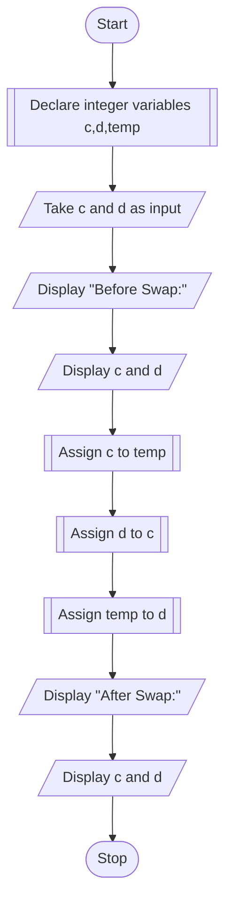

# PROBLEM 6
Two numbers are input through two locations c and d.
Write a program to interchange contents of c and d.

# ALGORITHM

1. Start
2. Declare integer variables c and d
3. Declare another variable temp
4. Take c and d as input
5. Display the values of the variables before swap
6. Assign a to temp
7. Assign b to a
8. Assign temp to b
9. Display values of a and b'
10. Stop

# PSEUDOCODE

```pseudocode
DECLARE INTEGER a and b
DECLARE INTEGER temp
INPUT a,b
DISPLAY "Before Swap:"
DISPLAY a,b
ASSIGN a to temp
ASSIGN b to a
ASSIGN temp to b
DISPLAY "After Swap:"
DISPLAY a,b
```

# FLOWCHART


